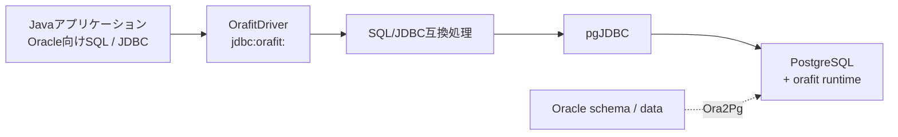

# Orafit

[English](README.md) | [日本語](README.ja.md)

**PostgreSQL移行向けの、範囲を限定したOracle SQL/JDBC互換レイヤー。**

[ドキュメント](https://yukkes.github.io/orafit/) | [互換性マトリクス](COMPATIBILITY.md)

Orafitは、Oracle向けJavaアプリケーションのSQLやJDBCの挙動をできるだけ維持したまま、データベースをPostgreSQLへ移行するための互換レイヤーです。Java 17のJDBC互換ドライバーと、小さなサーバー側SQLランタイムで構成されます。

Orafitは[Ora2Pg](https://ora2pg.darold.net/)と役割を分担します。データベースのスキーマとデータ移行はOra2Pgに任せ、Orafitはアプリケーション側のSQL/JDBC互換性を担います。Orafitは**Oracleエミュレーターではありません**。Oracleから見える挙動を確実に維持できない場合は、近似して実行せずステートメントを拒否します。

## Orafitの位置づけ



- `OrafitDriver`は`jdbc:orafit:` URLを受け付け、物理接続をpgJDBCへ委譲します。
- `OrafitEngine`は軽量なゲートで必要なSQLだけを判定し、Oracle固有処理が必要なステートメントだけを解析して、順序付きの変換を適用し、一度だけSQLを出力します。
- bindの同一性、RETURNING/OUTパラメーター、結果メタデータ、更新件数、トランザクション挙動、OracleベンダーエラーコードをJDBC境界で扱います。
- サーバー側の`orafit`ランタイムは、Oracleの数値・日時・文字列・正規表現、`LISTAGG`、階層クエリなど、PostgreSQLにそのまま存在しないセマンティクスを補います。

## 互換性の境界

| 項目 | 契約 |
|---|---|
| Oracleの基準 | Oracle Database 18c XE（唯一の互換性基準） |
| Java | 17以上 |
| PostgreSQL 15以下 | サポート対象外 |
| PostgreSQL 16 | サポート対象 |
| **PostgreSQL 17** | **主要サポート対象** |
| PostgreSQL 18 | 互換性チェックのみ |
| Aurora PostgreSQL 16/17 | plain SQLの`orafit`インストール経路でサポート |

移行前に[COMPATIBILITY.md](COMPATIBILITY.md)を確認してください。各互換性項目は✅ Supported、⚠️ Supported subset、⛔ Rejected、➖ Out of scopeに分類されます。Supportedの主張は実行可能なOracle 18cの証拠に紐付きます。記載されていない機能は、暗黙にサポートされるのではなく**未証明**です。

## はじめに

### 1. ランタイムとJDBCドライバーをビルドする

```bash
./mvnw package
```

`extension/src/`の同一ソースから、JDBC JARと2種類のサーバーランタイムパッケージを生成します。

```text
target/orafit/
├── native/   # orafit.control + orafit--1.0.0.sql
└── plain/    # orafit--1.0.0.sql（トランザクション単位のインストーラー）
```

`target/orafit-jdbc-<version>-runtime.tar.gz`も生成されます。

### 2. サーバーランタイムをインストールする

自分で管理するPostgreSQLでは、nativeパッケージをPostgreSQLのextensionディレクトリへ配置してインストールします。

```sql
CREATE EXTENSION orafit;
```

マネージドPostgreSQLやAuroraではplain SQLパッケージを実行します。

```bash
psql -v ON_ERROR_STOP=1 -f orafit--1.0.0.sql
```

plainインストーラーは、`orafit`スキーマとランタイムオブジェクトを1トランザクションで作成します。

#### Ora2Pg移行後のOracle BYTE長セマンティクス

移行元Oracleが既定の`NLS_LENGTH_SEMANTICS=BYTE`を使用し、Ora2Pgが長さ指定付きの`CHAR(n)`または`VARCHAR(n)`列を作成した場合は、データロードやアプリケーションからの書き込みを開始する前にバイト長制約を適用します。

```sql
SELECT orafit.apply_byte_length_semantics('public');
```

対象の移行元列がBYTEセマンティクスを使用し、Oracle/PostgreSQLのエンコーディングで意図したバイト数になる場合だけ使用してください。例えばOracle AL32UTF8からPostgreSQL UTF8への移行です。

### 3. JDBCドライバーを追加する

Orafit JARとpgJDBCをアプリケーションのクラスパスへ追加します。JSqlParserはOrafit JARへシェードされています。pgJDBCは意図的に同梱していないため、利用するバージョンをアプリケーション側で管理できます。

```properties
driver=io.github.orafit.jdbc.OrafitDriver
url=jdbc:orafit://<host>:<port>/<database>
```

`jdbc:orafit:`より後ろはURLパラメーターを含めてそのままpgJDBCへ渡されます。一般的なJDBC接続プールについてもテストスイートで確認します。

### トランザクション挙動

Oracleでは1つのステートメントが失敗しても明示的なトランザクションを継続利用できますが、PostgreSQLでは通常トランザクション全体が中断されます。Orafitは委譲先pgJDBC接続で`autosave=always`と`cleanupSavepoints=true`をデフォルトにし、Oracleに近い挙動を維持します。

明示的なpgJDBCプロパティはこのデフォルトより優先され、URLパラメーターはプロパティより優先されます。PostgreSQL本来のトランザクション中断動作を意図する場合だけ`autosave=never`を指定してください。

## 移行前分析

ビルド済みJARには、実行時と同じエンジン、機能ゲート、拒否コードを使うオフラインアナライザーも含まれます。

```bash
java -jar orafit-jdbc-<version>.jar path/to/sql
java -jar orafit-jdbc-<version>.jar --details path/to/sql
```

ディレクトリを指定すると`*.sql`を再帰的にスキャンします。レポートには、パススルー、変換、安定したコード別の拒否、対象外ステートメント、認識されたOracle機能の頻度をまとめます。詳細出力ではSQL本文を表示せず、ファイルとステートメント番号を示します。

`Accepted`は現在のエンジンが拒否しなかったという意味です。互換性の保証は[COMPATIBILITY.md](COMPATIBILITY.md)と、それに紐付く実行可能な証拠に基づきます。

## ビルドと検証

JDK 17以上が必要です。標準Maven Wrapperは初回実行時にchecksum検証済みのMaven 3.9.15とプロジェクト依存関係をダウンロードするため、Mavenキャッシュが構築されるまではネットワーク接続が必要です。

```bash
./mvnw test         # unit/contract + embedded PostgreSQLテスト
./mvnw verify       # 完全なゲート: format、JAR内容、パッケージ、tar.gz
./mvnw install      # 同じゲート + ローカルMavenリポジトリへinstall
./mvnw fmt:format   # JavaをAOSP形式で整形
mvn test            # MavenがPATHにある場合も同じsuite
```

`ORAFIT_JDBC_URL`を指定しない場合、DBテストは埋め込みZonky PostgreSQL 17.10 `linux-amd64`ランタイムを起動し、実際のバックエンドセッションでpgJDBC/Orafit経由の検証を行います。

既存のサポート対象PostgreSQLに対して同じテストを実行する場合は次のように指定します。

```bash
ORAFIT_JDBC_URL=jdbc:orafit://localhost:5432/postgres ./mvnw test
```

接続先に`orafit`がすでにインストール済みの場合は`-Dorafit.test.runtime=existing`を使用します。

Oracle差分ゲートは次のコマンドで実行します。

```bash
./.github/workflows/ci.sh
```

`act`とDockerを使ってGitHub Actions workflowを実行し、Oracle 18c XEとPostgreSQLのサポート対象差分を検証します。

## 互換性の証拠

互換性はPostgreSQL側の挙動だけから推測せず、実行可能な証拠で管理します。

- `src/test/resources/oracle/scope.toml`は`same` / `bounded` / `reject` / `outside`の境界を宣言し、Supported機能を正規ケースへ紐付けます。
- `src/test/resources/oracle/cases/**/*.toml`はOracleから見える正規ケースの一覧です。
- 差分テストでは、値、行順、NULLの動作、Oracleエラー、bind、OUT/RETURNING、結果メタデータ、更新件数、DML後の状態を比較します。
- 別のrelease corpusで、未対応構文が安全でないパススルーにならないことを確認します。

CIではOracle 18c XEを互換性の基準とし、埋め込みPostgreSQL 17.10を主要な比較対象にします。

## リポジトリ構成

```text
src/main/java/io/github/orafit/
├── OrafitEngine.java   # 変換エントリーポイント
├── parse/              # gate、bind/RETURNING/call codec、parser adapter
├── rewrite/            # 順序付きOracle→PostgreSQL変換ルール
├── metadata/           # Oracleから見える結果メタデータの計画
├── jdbc/               # driver、proxy、error、OUT bind、runtime挙動
├── translation/        # 変換結果型
└── tools/              # CompatibilityAnalyzer CLI
extension/src/          # 正規サーバーSQL（順序付き8モジュール）
src/test/resources/oracle/
├── scope.toml          # 宣言された互換性境界
├── cases/**/*.toml     # Oracleから見える正規ケース
└── fixtures/           # Oracle/PostgreSQL差分fixture
docs/                   # 静的な製品サイト
third-party/            # サードパーティーライセンス文
.mvn/wrapper/           # 標準Maven Wrapper設定
```

AIコーディングエージェント向けの開発指示は[AGENTS.md](AGENTS.md)にあります。

## ライセンス

Orafitは[Orafit License](LICENSE)の下でソースを公開しています。開発、テスト、評価、PoCは無償です。日立グループは、社内本番利用と顧客向け非本番作業についても無償で利用できます。それ以外の本番利用には別途商用ライセンスが必要です。

無償利用には、サポート、保守、アップデート、保証、互換性保証は含まれません。

サードパーティーコンポーネントには、それぞれのライセンスが適用されます。詳しくは[THIRD_PARTY_NOTICES.md](THIRD_PARTY_NOTICES.md)を参照してください。
