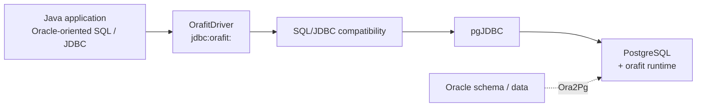

# Orafit

[English](README.md) | [日本語](README.ja.md)

**A bounded Oracle SQL/JDBC compatibility layer for PostgreSQL migrations.**

[Documentation](https://yukkes.github.io/orafit/) | [Compatibility matrix](COMPATIBILITY.md)

Orafit helps Oracle-oriented Java applications keep their application SQL and JDBC behavior while moving the database to PostgreSQL. It combines a Java 17 JDBC compatibility driver with a small server-side SQL runtime.

Orafit is designed to complement [Ora2Pg](https://ora2pg.darold.net/): use Ora2Pg for database schema and data migration, and Orafit for application-side SQL/JDBC compatibility. Orafit is **not an Oracle emulator**. If Oracle-visible behavior cannot be preserved with confidence, Orafit rejects the statement instead of silently approximating it.

## Where Orafit fits



- `OrafitDriver` accepts `jdbc:orafit:` URLs and delegates the physical connection to pgJDBC.
- `OrafitEngine` uses a lightweight gate, parses only statements that need Oracle handling, applies ordered rewrites, and renders the translated SQL once.
- Bind identity, RETURNING/OUT parameters, result metadata, update counts, transaction behavior, and Oracle vendor error codes are handled at the JDBC boundary.
- The `orafit` server runtime supplies semantics PostgreSQL does not provide directly, including helpers for Oracle number, date/time, string, regexp, `LISTAGG`, and hierarchy behavior.

## Compatibility boundary

| Item | Contract |
|---|---|
| Oracle reference | Oracle Database 18c XE (sole compatibility authority) |
| Java | 17+ |
| PostgreSQL 15 and older | Not supported |
| PostgreSQL 16 | Supported target |
| **PostgreSQL 17** | **Primary supported target** |
| PostgreSQL 18 | Compatibility check only |
| Aurora PostgreSQL 16/17 | Supported through the plain-SQL `orafit` installation path |

Read [COMPATIBILITY.md](COMPATIBILITY.md) before migration. Each compatibility area is classified as ✅ Supported, ⚠️ Supported subset, ⛔ Rejected, or ➖ Out of scope. Supported claims are tied to executable Oracle 18c evidence; anything not covered is **unproven**, not implicitly supported.

## Getting started

### 1. Build the runtime and JDBC driver

```bash
./mvnw package
```

The build produces the JDBC JAR and two server-runtime packages from the same source under `extension/src/`:

```text
target/orafit/
├── native/   # orafit.control + orafit--1.0.0.sql
└── plain/    # orafit--1.0.0.sql (transactional installer)
```

It also creates `target/orafit-jdbc-<version>-runtime.tar.gz`.

### 2. Install the server runtime

On self-managed PostgreSQL, copy the native package into the PostgreSQL extension directory and install it:

```sql
CREATE EXTENSION orafit;
```

On managed PostgreSQL or Aurora, run the plain SQL package instead:

```bash
psql -v ON_ERROR_STOP=1 -f orafit--1.0.0.sql
```

The plain installer creates the `orafit` schema and runtime objects in one transaction.

#### Oracle BYTE length semantics after Ora2Pg

When the Oracle source uses the default `NLS_LENGTH_SEMANTICS=BYTE` and Ora2Pg has created bounded `CHAR(n)` or `VARCHAR(n)` columns, apply byte-length constraints before loading data or starting application writes:

```sql
SELECT orafit.apply_byte_length_semantics('public');
```

Use this only when the affected source columns use BYTE semantics and the Oracle/PostgreSQL encodings give the intended byte counts, for example Oracle AL32UTF8 to PostgreSQL UTF8.

### 3. Add the JDBC driver

Put the Orafit JAR and pgJDBC on the application classpath. JSqlParser is shaded into the Orafit JAR; pgJDBC is intentionally not bundled so the application controls its pgJDBC version.

```properties
driver=io.github.orafit.jdbc.OrafitDriver
url=jdbc:orafit://<host>:<port>/<database>
```

Everything after `jdbc:orafit:` is passed to pgJDBC unchanged, including URL parameters. Orafit is also exercised with common JDBC connection pools in the test suite.

### Transaction behavior

Oracle keeps an explicit transaction usable after a single statement fails; PostgreSQL normally aborts it. Orafit defaults the delegated pgJDBC connection to `autosave=always` and `cleanupSavepoints=true` to preserve the Oracle-style behavior.

Explicit pgJDBC properties override these defaults, and URL parameters override properties. Set `autosave=never` only when native PostgreSQL transaction-abort behavior is intentional.

## Pre-migration analysis

The built JAR also provides an offline analyzer that uses the same engine, feature gate, and rejection codes as the runtime:

```bash
java -jar orafit-jdbc-<version>.jar path/to/sql
java -jar orafit-jdbc-<version>.jar --details path/to/sql
```

Directories are scanned recursively for `*.sql`. The report groups pass-through statements, rewritten statements, rejections by stable code, out-of-scope statements, and recognized Oracle-feature frequency. Detailed output identifies files and statement ordinals without printing SQL text.

`Accepted` means the current engine did not reject the statement. Compatibility guarantees still come from [COMPATIBILITY.md](COMPATIBILITY.md) and the executable evidence tied to it.

## Build and verification

JDK 17+ is required. The standard Maven Wrapper downloads checksum-verified Maven 3.9.15 and project dependencies on first use, so network access is required until the Maven cache is populated.

```bash
./mvnw test         # unit/contract tests + embedded PostgreSQL suite
./mvnw verify       # full gate: formatting, JAR contents, packages and tar.gz
./mvnw install      # same gate + install into the local Maven repository
./mvnw fmt:format   # apply Java formatting (AOSP)
mvn test            # same suite when Maven is already on PATH
```

Without `ORAFIT_JDBC_URL`, the database suite starts the embedded Zonky PostgreSQL 17.10 `linux-amd64` runtime and tests through pgJDBC/Orafit with real backend sessions.

To run the same suite against an existing supported PostgreSQL instance:

```bash
ORAFIT_JDBC_URL=jdbc:orafit://localhost:5432/postgres ./mvnw test
```

Use `-Dorafit.test.runtime=existing` when `orafit` is already installed on the target database.

For the Oracle differential gate:

```bash
./.github/workflows/ci.sh
```

This runs the supported Oracle 18c XE versus PostgreSQL differential through the GitHub Actions workflow using `act` and Docker.

## Compatibility evidence

Compatibility claims are executable rather than inferred from PostgreSQL behavior alone:

- `src/test/resources/oracle/scope.toml` declares the `same` / `bounded` / `reject` / `outside` boundary and links Supported features to canonical cases.
- `src/test/resources/oracle/cases/**/*.toml` is the canonical Oracle-visible case inventory.
- Differential tests compare values, row order, NULL behavior, Oracle errors, binds, OUT/RETURNING behavior, result metadata, update counts, and DML post-state.
- A separate release corpus verifies that unsupported syntax does not become unsafe pass-through.

CI uses Oracle 18c XE as the compatibility reference and embedded PostgreSQL 17.10 as the primary comparison target.

## Repository layout

```text
src/main/java/io/github/orafit/
├── OrafitEngine.java   # translation entry point
├── parse/              # gate, bind/RETURNING/call codecs, parser adapter
├── rewrite/            # ordered Oracle-to-PostgreSQL lowering rules
├── metadata/           # Oracle-visible result metadata planning
├── jdbc/               # driver, proxies, errors, OUT binds, runtime behavior
├── translation/        # translation result types
└── tools/              # CompatibilityAnalyzer CLI
extension/src/          # canonical server SQL (8 ordered modules)
src/test/resources/oracle/
├── scope.toml          # declared compatibility boundary
├── cases/**/*.toml     # canonical Oracle-visible cases
└── fixtures/           # Oracle/PostgreSQL differential fixtures
docs/                   # static product site
third-party/            # third-party license texts
.mvn/wrapper/           # standard Maven Wrapper configuration
```

AI coding-agent instructions are in [AGENTS.md](AGENTS.md).

## License

Orafit is source-available under the [Orafit License](LICENSE). Development, testing, evaluation, and proof-of-concept use are free. Hitachi Group companies may also use Orafit free of charge for internal production and customer non-production work. Other production use requires a separate commercial license.

Free use does not include support, maintenance, updates, warranty, or compatibility guarantees.

Third-party components remain under their respective licenses. See [THIRD_PARTY_NOTICES.md](THIRD_PARTY_NOTICES.md).
